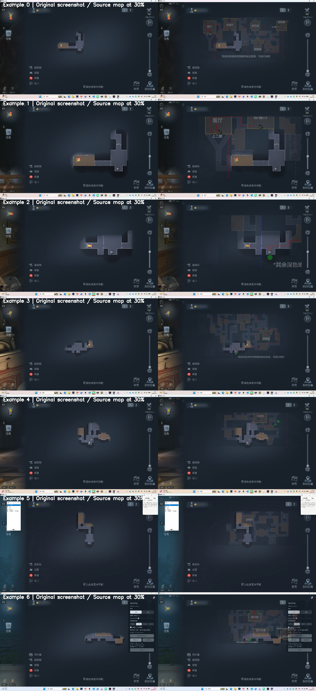
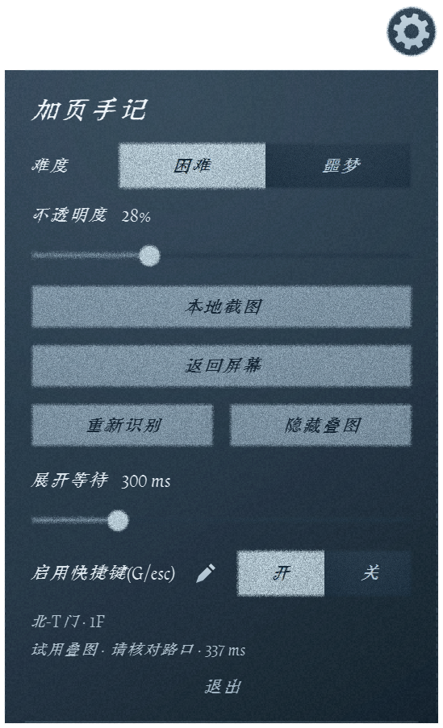
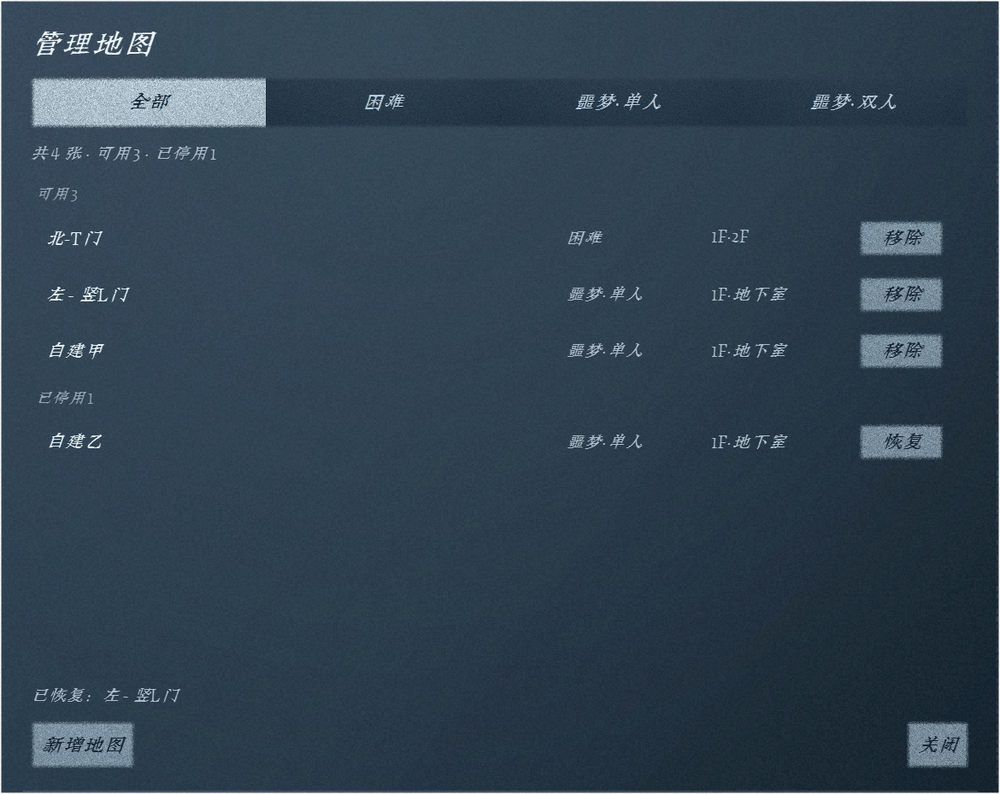
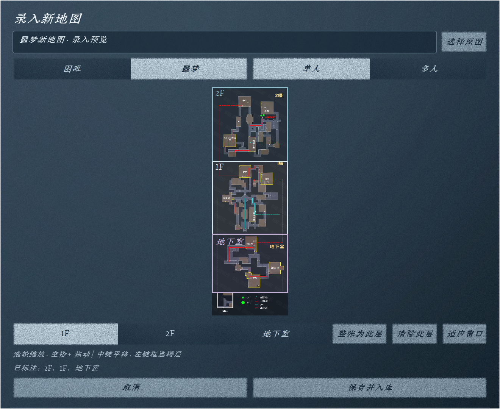

# 加页手记 · 地图助手

<p align="center"></p>

这是一个给《第五人格》PC端「加页手记」娱乐模式的 Windows 悬浮地图助手。你打开游戏里的地图后，它会看一眼屏幕，判断你现在是哪张地图，再把对应的完整路线图半透明叠到屏幕上，帮你在没探索完整的地图里找路。

正常使用时，你只需要做一件事：提前打开助手，即可自动显示完整的地图与推荐探索路线。



这个工具只读取屏幕画面，不读取游戏内存，不修改游戏文件，也不注入游戏进程。它做的事更像“自动看截图并帮你对齐一张透明参考图”。

## 它能帮你做什么

支持本地记录成功与失败案例。在设置中开启「记录识别案例」，通过「打开记录」找到截图、程序版本、触发原因和诊断数据；每个分类各保留最近 20 条，超出自动删除最早的记录。协作者可将整个目录压缩后发送给开发者。记录不会自动上传，分享前请检查截图内容。详见 [案例收集说明](docs/failure-records.md)。

悬浮入口支持可选的布偶外观，点击展开设置、拖动调整位置，状态提示以气泡显示。在设置最下方可通过「个性外观：开 / 关」恢复齿轮入口，不影响地图识别和叠图。布偶采用分层关节动画，按操作和识别结果招手、比心或挠头。

加页手记的问题是：游戏里看到的地图是不完整的，容易晕头转向不知道探索路线和方向。这个助手会把两件事合在一起：

- 手动选择当前是困难还是噩梦里的哪张地图。
- 自动把完整路线图缩放、平移到屏幕地图上。
- 用默认 30% 透明度悬浮显示，不挡住游戏画面。
- 地图关掉或按 Esc 后，叠图会清掉。
- 如果上一轮已经识别过地图，下一次会优先复用这张图，只重新对齐位置，速度更快。
- 识别失败时会在齿轮旁边给一句简短提示，比如“未匹配”“内容太少”“请先打开地图”。

目前内置 67 张地图：困难 28 张、噩梦单人 21 张、噩梦多人 18 张。

## 下载和启动

打开 [Releases](https://github.com/HenryChen27/crypticNotes/releases/latest)，下载 **IdentityVMapAssistant-Windows-x64.zip**。

下载后请这样做：

1. 把 ZIP 完整解压到一个普通文件夹。
2. 双击 `crypticNotes.cmd`。
3. 屏幕上会出现一个小齿轮。
4. 点击齿轮，选择难度；噩梦难度再选择单人或多人。
5. 配置地图快捷键，你需要将其设置为与游戏内打开故事地图的快捷键相同，默认为**G**。
6. 回到游戏，通过快捷键打开地图时将自动显示完整地图。

不要在压缩包里直接运行，也不要只复制 EXE。这个程序旁边需要带着 `maps/` 地图库、字体和其他资源文件。

建议把它放在桌面、D 盘或其他普通目录。不要放到 `C:\Program Files\` 这类受保护目录，否则新增地图和地图管理可能写不进去。

### 放一个快捷方式到桌面

完整解压后，双击 `create-shortcut.cmd`，同一文件夹里会生成带项目图标的 `加页手记地图插件.lnk` 快捷方式。把这个快捷方式拖到桌面，以后双击它即可启动。

快捷方式按每个人实际解压的位置生成，不包含开发者电脑的固定地址。请保留完整的程序文件夹；如果移动了程序文件夹，重新运行 `create-shortcut.cmd`，再用新生成的快捷方式替换桌面上的旧快捷方式。也可以右键 `crypticNotes.cmd`，选择“发送到 → 桌面快捷方式”（Windows 11 可能需要先点“显示更多选项”）。

### 以后怎么更新

有两条路，按你的情况挑一条：

**电脑上装过 Git 的（推荐）** —— 双击程序文件夹里的 `更新.cmd`。（新发布的 ZIP 里自带它；如果你手上这份文件夹里没有，说明是更早的包，先从 Releases 下最新的 ZIP 覆盖一次。）它每次只下载真正变了的文件，通常几秒钟，不用重下整个包。第一次双击会先把当前文件夹接进更新通道，那一次要多下约 220 MB，之后就都是几 MB 了。

没装 Git 也不要紧：`更新.cmd` 会告诉你，装上 Git for Windows（<https://git-scm.com/download/win>，一路点“下一步”即可）再双击就行，只需要装这一次。

**没装、也不想装的** —— 还是从 [Releases](https://github.com/HenryChen27/crypticNotes/releases/latest) 下载 ZIP，解压覆盖原文件夹。老办法，能用，只是每次都要重下约 220 MB。

更新换掉的只是程序本身，**你在 `maps/` 里自己放的原图不会被动到**。唯一会重置的是「管理地图」里的移除/新增记录——它会回到发布时的样子，重新点几下即可。

## 平时怎么用

启动后，助手默认只显示一个悬浮齿轮：


点击齿轮可以展开设置面板。你可以在里面切换难度、噩梦人数、透明度、等待地图展开的时间，以及修改快捷键。

面板底部的“管理地图”和“本地截图”并排显示，提示信息和“退出”在它们下方。



常用操作很少：

- **G**：识别当前地图并显示叠图。
- **Esc**：隐藏叠图并清除当前状态。
- **Backspace（退格键）**：隐藏叠图；再次按下会重新显示并匹配。该键可在设置中修改。
- 再按 **G**：重新读取屏幕并匹配。
- 鼠标滚轮和拖动游戏地图后，再按 G 可以重新对齐。

如果你不想进游戏测试，可以双击「本地截图测试.cmd」，选择一张游戏截图，在弹出的截图窗口里按 G。这样可以假装那张图就是游戏画面。

地图开关快捷键和隐藏叠图快捷键不能设置成同一个按键；发生冲突时会提示并拒绝保存。

## 管理和新增地图

点齿轮里的「管理地图」，可以查看全部地图。每一行都能看到名称、难度和楼层，点行身还能看缩略图。



如果疯狂星期四更新新的地图刷点，可以蹲蹲大佬们制作的地图。新增地图也在这个窗口里。流程是：

1. 点击「新增地图」。
2. 选择完整地图原图。
3. 填名称、难度和人数。
4. 用鼠标框选 1F、2F、地下室。
5. 保存。



录入长图时可以用滚轮缩放，按住空格拖动地图位置，也可以用鼠标中键平移。楼层框允许少量重叠，因为有些路线图为了省空间会把几层拼在一起。

只把图片粘进 `maps/` 不会让它自动参与识别。必须通过「新增地图」登记过，程序才知道它是哪种难度、哪一层在哪个区域。

你也可以停用不想参与匹配的地图，也可以恢复它。这里的“停用”不会删除原图，只是不让它参与识别。

## 常见问题

**为什么有时候需要管理员权限？**  
如果游戏本身是管理员权限运行的，普通权限程序可能读不到它上面的按键或画面。用管理员权限启动助手会更稳。

**为什么没有匹配上？**  
通常是地图打开得太少、缩放太大、画面里有效地图结构太少，或者当前截图和内置地图差异很大。多探索一点地图，或者把地图缩小后再按 G。

**这个会不会改游戏？**  
不会。它只看屏幕截图，然后显示自己的透明窗口。

**不会装 Python 能用吗？**  
用 Release 里的 ZIP 就不需要 Python。源码运行才需要 Python。

**更新版本时要注意什么？**  
装过 Git 就双击 `更新.cmd`，否则下载 ZIP 解压覆盖，两种都行，见[以后怎么更新](#以后怎么更新)。

打包版的地图库在程序目录的 `maps/` 里。**你自己放进去的原图不会被更新删掉**，但「管理地图」里的移除/新增记录存在 `maps/floors.json`，而它属于发布内容，更新后会被重置回发布时的状态（原图仍在，重新录入即可）。介意的话，更新前先把 `maps/floors.json` 复制一份。

## 源码运行

如果你只是使用插件，可以跳过这一段。

源码版需要 64 位 Python 3.13。第一次运行双击 `setup.cmd`，它会在项目目录里创建 `.venv` 并安装依赖。之后双击 `crypticNotes.cmd` 启动。

命令行启动方式：

```powershell
.venv\Scripts\python.exe -m mapmatching.launch
```

不建议直接用系统 Python 裸跑 UI，除非你已经在当前环境安装好了 `mapmatching/requirements-ui.txt` 里的依赖。

## 自己打包

```powershell
.venv\Scripts\python.exe -m pip install -r requirements-build.txt
.venv\Scripts\python.exe scripts\build_windows.py
```

成品在 `dist/IdentityVMapAssistant/`。发布时要压缩整个文件夹，不能只拿 EXE。

### 发布新版本

一条命令走完：打包 → 整理源码 → 推源码 → 推分发包 → 建 Release。

```bash
scripts/release.sh                     # 全流程。真正推送前会停下来问你一次
scripts/release.sh --local             # 只在本机做完（打包 + 提交），一个字节都不推
scripts/release.sh --no-build          # 跳过 PyInstaller，复用现有 dist/
scripts/release.sh --no-release        # 推完就停，不建 GitHub Release
scripts/release.sh -m "提交信息"        # 两个仓库共用的提交信息
scripts/release.sh --note "本次更新…"   # Release 正文里「本次更新」一节的内容
```

`--note` 建议每次都写。不给它时那一节由「上个 Release 以来的提交标题」自动生成，但分享仓库的提交标题基本都是 `release: 更新源码与地图库`（真正的工作在开发仓库里，每次发版压成一条），所以自动生成的结果通常很单薄。

推送之前它会打印这次要发的东西（源码提交、分发文件数、Release 的 tag），确认了才动手。主仓库 `c:\jysj` 故意不配远端，本脚本也不碰它：源码走 `release/crypticNotes` 这个独立 clone，分发包走 `out/dist_repo`。

步骤之间有顺序依赖，这也是 `release.sh` 存在的理由——zip 由打包脚本从 `dist/` 压出来，而协作者双击的 `更新.cmd` 是分发脚本才拷进 `dist/` 的，谁先谁后都会漏东西（上一版 zip 就这么少了更新入口，578 个文件里一个都没有）。

只想单独做其中一步时，各个脚本仍可单独跑：

```bash
scripts/publish_dist.sh --local        # 只组装并提交分发分支，不推送
scripts/publish_dist.sh                # 组装并推送分发分支
powershell -File scripts/publish_release.ps1 -DryRun    # 只看 Release 正文长什么样，不联网
```

**打包会清空 `dist/`，更新入口每次都由脚本重新拷进去，别去手改成品目录里的副本。** 分发仓库用独立的 `GIT_DIR`（`out/dist_repo/.git`）配 `core.worktree` 指向 `dist/IdentityVMapAssistant`——因为打包会删掉整个 `dist/`，`.git` 放在里面会被一起删掉。

Release 的正文来自 `scripts/release-notes.md`：第一行是标题，其余是正文，里面的 `{{TOTAL}}`/`{{HARD}}`/`{{SOLO}}`/`{{DUO}}` 由 `maps/floors.json` 现场数出来，`{{CHANGELOG}}` 是上一个 Release 以来的提交摘要，`{{SHA256}}` 取自 `release/SHA256SUMS.txt`。改文案只改这个 md，不要再把数字写死在别处（正文里那句「内置 62 张地图」就是这么过期成 67 的）。

几个坑已经踩过，改动时留意：

- `更新.cmd` 必须是**纯 ASCII**。cmd.exe 按字节偏移定位批处理文件的下一行，文件里混入 GBK 中文会让偏移算错、从某一行中间开始执行（表现为「命令语法不正确」）。所有中文都在 `update-client.ps1` 里。
- `update-client.ps1` 必须是 **UTF-8 with BOM** 且 CRLF，否则 PowerShell 读成乱码。
- 这两条不是靠自觉：拷贝和校验都在 `scripts/dist_extras.py` 里，打包（`finalize_release.py`）和分发（`publish_dist.sh`）调的是同一个函数，编码不对就拒绝发布。
- `scripts/publish_release.ps1` 本身也是**纯 ASCII**：PowerShell 5.1 只在有 BOM 时才按 UTF-8 读 `.ps1`，而 BOM 下次编辑很容易丢，所以中文一律不进这个文件（标题和正文都在 `release-notes.md` 里）。

## 当前验证状态

本地检查结果：

- `.venv\Scripts\python.exe -m unittest discover -s mapmatching/tests -q`：58 个测试通过。
- `.venv\Scripts\python.exe -m mapmatching.benchmarks.nightmare_smoke`：噩梦单人/多人合成场景 93/93 通过。
- 打包 EXE 的 `--self-test` 通过：能加载 Qt、字体、67 张地图和匹配子进程。
- `maps/floors.json`：67 张地图无重复 ID、无缺失原图、无 SHA256 不一致。
- 分发通道 `更新.cmd` 端到端跑通：首次接入、增量更新、软删除状态、协作者自录地图不被删除，以及中文提示的编码。
- 发版流水线 `scripts/release.sh --local` 跑通：打包 → 注入更新入口 → 压缩 → 整理分享仓库 → 提交分发分支，全程无推送。产出 zip 613 个文件，`更新.cmd` 与 `scripts/update-client.ps1` 都在里面且与成品目录逐字节相同；打包 EXE 自检 `ok: true`。
- 两个更新入口的字节在 `core.autocrlf` 的 `true`/`false`/`input` 三档下签出结果逐字节相同（`.gitattributes` 里对它们标了 `-text`）。协作者那台机器的设置我们看不到，所以不能只靠「本机这次没坏」。

噩梦测试目前主要是原图派生的合成场景，能证明地图库和叠图链路没断；真实迷雾、不同分辨率和不同游戏布局仍需要更多实战截图验证。看不清、候选过于相似或楼层不确定时，程序会拒绝叠图。

## 项目结构

```text
mapmatching/         界面、识别、配准、测试和基准脚本
maps/                地图库：原图 + floors.json 登记表
docs/images/         README 效果图
scripts/             启动、打包、发布分发、整理分享仓库脚本
examples/            本地测试截图
```

`maps/index.json`、`maps/evidence/`、`maps/disabled.json` 是缓存或本机状态，可以重建，不进仓库。`maps/` 里的原图和 `floors.json` 是需要备份的源数据。

发布包不走本仓库，走 `crypticNotes` 的 `dist` 分支，由 `scripts/release.sh` 串起 `build_windows.py` → `prepare_share.py` → `publish_dist.sh` → `publish_release.ps1`。协作者侧的入口是 `scripts/更新.cmd`（纯 ASCII 引导）和 `scripts/update-client.ps1`（UTF-8 BOM，承载逻辑与中文提示），两者都由 `scripts/dist_extras.py` 注入发布目录并校验编码，所以 zip 和 `dist` 分支里都会有。

## 地图来源与致谢

内置地图和路线图来源于凉哈皮，本项目没有绘制地图，只做识别与配准。

凉哈皮是《第五人格》早期职业选手，后来转型为 B 站主播与赛事解说，长期参与 IVC、COA、IVL 等赛事解说。他发布的「加页手记」全地图路线攻略与地图图鉴是本项目地图库来源，包括 07.10 困难全图、08.26 与 09.10 噩梦单/双人路线图。

- [凉哈皮：加页手记全地图路线攻略与地图图鉴](https://www.bilibili.com/video/BV1nf7s6DEFc/)
- [凉哈皮 B 站主页](https://space.bilibili.com/8618005)
- [凉哈皮 · 第五人格 WIKI](https://wiki.biligame.com/dwrg/%E5%87%89%E5%93%88%E7%9A%AE)

请保留原地图、水印和来源说明，支持原作者。游戏素材归相应权利人所有。

## 声明

本项目仅供个人学习、研究与交流使用，完全免费，不做商用，不提供付费版本或增值服务。本项目与《第五人格》的开发商、发行商及任何官方机构没有关系，非官方项目，未获官方背书或授权。

仓库内地图、路线图、字体等素材版权不属于本项目。若你是权利人且不希望相关内容在此分发，请提 issue 或联系仓库所有者，收到通知后会删除。
