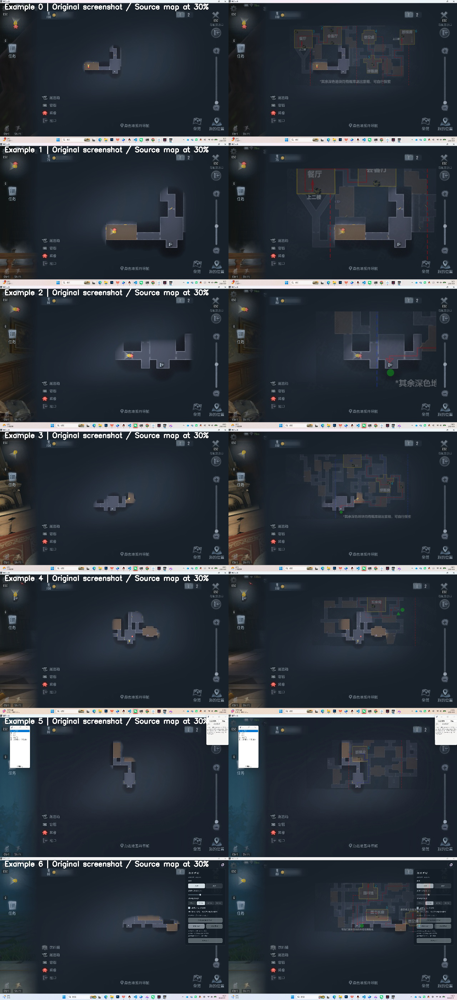
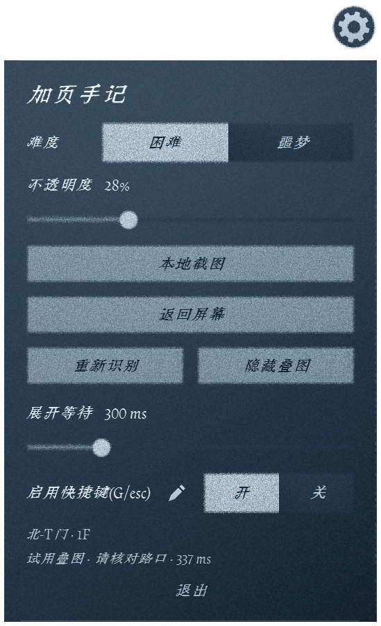
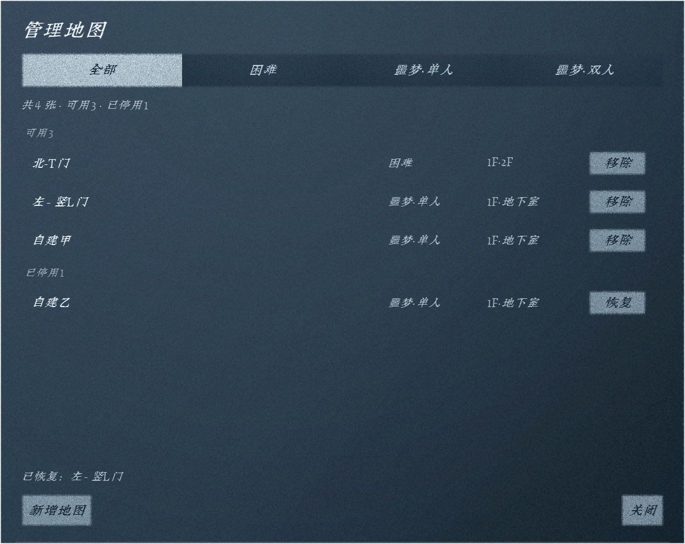
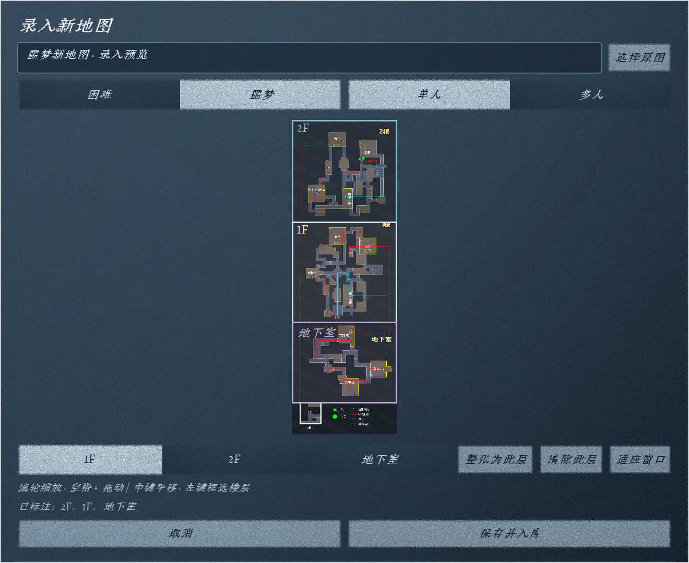

# 加页手记 · 地图助手

<p align="center"></p>

这是一个给《第五人格》PC端「加页手记」娱乐模式的 Windows / macOS 悬浮地图助手。你打开游戏里的地图后，它会看一眼屏幕，判断你现在是哪张地图，再把对应的完整路线图半透明叠到屏幕上，帮你在没探索完整的地图里找路。

正常使用时，你只需要做一件事：提前打开助手，即可自动显示完整的地图与推荐探索路线。



这个工具只读取屏幕画面，不读取游戏内存，不修改游戏文件，也不注入游戏进程。它做的事更像“自动看截图并帮你对齐一张透明参考图”。

## 它能帮你做什么

支持本地记录成功与失败案例。在设置中开启「记录识别案例」，通过「打开记录」找到截图、程序版本、触发原因和诊断数据；每个分类各保留最近 20 条，超出自动删除最早的记录。协作者可将整个目录压缩后发送给开发者。记录不会自动上传，分享前请检查截图内容。详见 [案例收集说明](docs/failure-records.md)。

悬浮入口支持可选的布偶外观，点击展开设置、拖动调整位置，状态提示以气泡显示。在设置最下方可通过「个性外观：开 / 关」恢复齿轮入口，不影响地图识别和叠图。布偶采用分层关节动画，按操作和识别结果招手、比心或挠头。

加页手记的问题是：游戏里看到的地图是不完整的，容易晕头转向不知道探索路线和方向。这个助手会把两件事合在一起：

- 手动选择当前是困难还是噩梦里的哪张地图。
- 自动把完整路线图缩放、平移到屏幕地图上。
- 用默认 30% 透明度悬浮显示，不挡住游戏画面。
- 地图关掉或按 Esc 后，叠图会清掉。
- 如果上一轮已经识别过地图，下一次会优先复用这张图，只重新对齐位置，速度更快。
- 识别失败时会在齿轮旁边给一句简短提示，比如“未匹配”“内容太少”“请先打开地图”。

目前内置 73 张地图：困难 28 张、噩梦单人 27 张、噩梦多人 18 张。（数字由 `maps/floors.json` 现场数出，Release 正文里的那份是自动填的；这行是手写的，改地图库时记得一起改。）

## 下载和启动

打开 [Releases](https://github.com/HenryChen27/crypticNotes/releases/latest)，下载 **IdentityVMapAssistant-Windows-x64.zip**。

macOS 用户按芯片下载 **IdentityVMapAssistant-macOS-arm64.zip**（M1/M2/M3/M4）或 **IdentityVMapAssistant-macOS-x64.zip**（Intel），解压后把“加页手记”拖入“应用程序”。

从这一版起，程序自带签名（自签名证书）。**第一次**装这一版，需要在“系统设置 → 隐私与安全性”里把“屏幕录制”和“输入监控”**各允许一次**，然后彻底退出再打开；**这一次之后，以后更新都不用再授权**。以前的版本每更新一次就得重来一遍，那是签名方式的问题——系统把每次更新都当成了一个全新应用。

以前装过旧版的话，列表里可能留着一个「打着勾却不起作用」的“加页手记”。用减号把那一项删掉，或者双击解压出来的 `诊断问题.command`，照它给的提示清一下，再重新授权。

**自签名不等于苹果认可**：它只让系统记住你授权过谁，苹果仍然不认识这个作者。所以每个新下载的版本第一次打开时，**还是**会弹“无法验证开发者”——右键点“加页手记” → 选“打开” → 再点“打开”就能用。这一步不会因为签名而消失（要彻底不弹，得买每年 99 美元的 Apple 开发者账号并做公证）。

下载后请这样做：

1. 把 ZIP 完整解压到一个普通文件夹。
2. 双击 `crypticNotes.cmd`。
3. 屏幕上会出现一个小齿轮。
4. 点击齿轮，选择难度；噩梦难度再选择单人或多人。
5. 配置地图快捷键，你需要将其设置为与游戏内打开故事地图的快捷键相同，默认为**G**。
6. 回到游戏，通过快捷键打开地图时将自动显示完整地图。

不要在压缩包里直接运行，也不要只复制 EXE。这个程序旁边需要带着 `maps/` 地图库、字体和其他资源文件。

建议把它放在桌面、D 盘或其他普通目录。不要放到 `C:\Program Files\` 这类受保护目录，否则新增地图和地图管理可能写不进去。

### 放一个快捷方式到桌面

完整解压后，双击 `create-shortcut.cmd`，同一文件夹里会生成带项目图标的 `加页手记地图插件.lnk` 快捷方式。把这个快捷方式拖到桌面，以后双击它即可启动。

快捷方式按每个人实际解压的位置生成，不包含开发者电脑的固定地址。请保留完整的程序文件夹；如果移动了程序文件夹，重新运行 `create-shortcut.cmd`，再用新生成的快捷方式替换桌面上的旧快捷方式。也可以右键 `crypticNotes.cmd`，选择“发送到 → 桌面快捷方式”（Windows 11 可能需要先点“显示更多选项”）。

### 以后怎么更新

在插件的「使用偏好」中点击 **检查更新**，或双击程序目录里的 `更新.cmd`。不需要安装 Git，也不需要 GitHub 账号。

更新窗口会先检查版本，有新版时显示下载进度。下载并校验成功后，自动退出当前目录的插件、替换程序并重新启动；下载失败不修改程序，替换失败会尝试回退并显示原因。需要能够访问 GitHub；新版采用完整包下载，不是 Git 的增量下载。

下载中途断网会自动重试（GitHub 的发布包不支持断点续传，只能重下整个包，最多 4 次）；开始下载前会先检查临时目录所在磁盘是否装得下。失败时窗口里显示的是**真正的原因**和 `updater.log` 的路径，日志里保留完整异常链。

macOS 版没有站内更新：点击「检查更新」会按当前芯片（Apple 芯片 / Intel）直接下载对应的包，下载完成后退出应用、用新的替换旧应用即可。**换完之后不需要重新授权**屏幕录制和输入监控。

### macOS：授权和「仍要打开」是两件不相干的事

用户最常问的就是「不是签名了吗，怎么还要点」。因为这是两套不同的机制：

- **授权**（屏幕录制、输入监控）看的是**签名里的身份**。以前的身份是每次构建都会变的临时身份，系统就以为每次更新都换了个应用，授权于是每次清零；换成自签名证书后身份固定了，授权就只需要给一次。
- **「无法验证开发者」**看的是**苹果认不认可这个作者**。自签名证书是我们自己做的，苹果不认识它，所以那道提示照旧。

一句话：**授权只用点一次，但每个新下载的版本第一次打开，「仍要打开」还会来一次。** 这是预期行为，不是出错。

要是截图或热键不工作，双击解压出来的 `诊断问题.command`（就躺在“加页手记.app”旁边）。它只读不写，会把当前状态汇总到桌面上的「加页手记诊断.txt」，整份发回来即可。报告里 `spctl ... rejected` 是正常的；真正要看的是最上面那条**指定要求**：出现 `certificate leaf[subject.CN] = "..."` 才算对，出现 `cdhash` 就说明这份包是旧的临时签名。

**设置和识别记录保持原样**（存在 `%LOCALAPPDATA%\IdentityVMapAssistant`）。地图库是另一回事：更新把程序目录里的 `maps/` **整棵换成发布版那一份**，好让每个人拿到的地图与内置库一致 —— 所以自己录入的图和「管理地图」里的移除状态**不会保留**，想留着就在更新前把 `maps/` 复制到别处，更新后再录入回去。

旧版没有「检查更新」或仍提示安装 Git：先下载最新 ZIP 并解压到新文件夹，之后即可使用新更新器。不要覆盖自己的地图目录；需要沿用地图时复制原来的 `maps/` 文件夹。

## 平时怎么用

启动后，助手默认只显示一个悬浮齿轮：


点击齿轮可以展开设置面板。你可以在里面切换难度、噩梦人数、透明度、等待地图展开的时间，以及修改快捷键。

面板底部的“管理地图”和“本地截图”并排显示，提示信息和“退出”在它们下方。



常用操作很少：

- **G**：识别当前地图并显示叠图。
- **Esc**：隐藏叠图并清除当前状态。
- **Backspace（退格键）**：隐藏叠图；再次按下会重新显示并匹配。该键可在设置中修改。
- 再按 **G**：重新读取屏幕并匹配。
- 鼠标滚轮和拖动游戏地图后，再按 G 可以重新对齐。

如果你不想进游戏测试，可以双击「本地截图测试.cmd」，选择一张游戏截图，在弹出的截图窗口里按 G。这样可以假装那张图就是游戏画面。

### 快捷键能选哪些键

点快捷键旁边的铅笔就能改，**按一下你想用的那个键就行**，不用记名字。除了字母和数字，还能选：

- **鼠标**：右键、中键、侧键 1（靠后那个）、侧键 2（靠前那个）。鼠标键直接把指针放在那个小框里按就行。左键选不了——它是游戏里拖动地图的手势，助手靠它判断你什么时候停手。
- **修饰键**：Ctrl、Shift、Alt（不分左右，按哪边都算）。
- **功能键**：F1–F24、方向键、小键盘 0–9 与 `* + - . /`、大写锁定、数字锁定、Tab、空格、回车、退格、Insert/Delete/Home/End/PageUp/PageDown、Pause、PrintScreen、ScrollLock、菜单键。
- **符号键**：`- = [ ] \ ; ' , . / `` `。

滚轮不能当快捷键：它既是游戏的缩放，也是助手判断「停手了」的信号。Win 键也不行——单独按它会弹出开始菜单。右键能选，但要留意游戏自己有没有用右键；助手这边不影响跟随（跟随只看左键和滚轮）。

地图开关快捷键和隐藏叠图快捷键不能设置成同一个按键；发生冲突时会提示并拒绝保存。鼠标键只有在助手能监听鼠标时才收得到（启动时会提示）；游戏以管理员权限运行时，用管理员权限启动助手更稳。

## 管理和新增地图

点齿轮里的「管理地图」，可以查看全部地图。每一行都能看到名称、难度和楼层，点行身还能看缩略图。



如果疯狂星期四更新新的地图刷点，可以蹲蹲大佬们制作的地图。新增地图也在这个窗口里。流程是：

1. 点击「新增地图」。
2. 选择完整地图原图。
3. 填名称、难度和人数。
4. 用鼠标框选 1F、2F、地下室。
5. 保存。



录入长图时可以用滚轮缩放，按住空格拖动地图位置，也可以用鼠标中键平移。楼层框允许少量重叠，因为有些路线图为了省空间会把几层拼在一起。

只把图片粘进 `maps/` 不会让它自动参与识别。必须通过「新增地图」登记过，程序才知道它是哪种难度、哪一层在哪个区域。

录错类型或不再需要的地图，可以在「管理地图」中彻底删除。确认后会删除库内原图、楼层登记和识别缓存，无法恢复；录入时选择的外部原始图片不受影响，可以按正确类型重新录入。旧版已停用的地图也可以彻底删除。内置地图可能随之后的程序更新重新带回。

## 常见问题

**为什么有时候需要管理员权限？**  
如果游戏本身是管理员权限运行的，普通权限程序可能读不到它上面的按键或画面。用管理员权限启动助手会更稳。

**为什么没有匹配上？**  
通常是地图打开得太少、缩放太大、画面里有效地图结构太少，或者当前截图和内置地图差异很大。多探索一点地图，或者把地图缩小后再按 G。

**这个会不会改游戏？**  
不会。它只看屏幕截图，然后显示自己的透明窗口。

**不会装 Python 能用吗？**  
用 Release 里的 ZIP 就不需要 Python。源码运行才需要 Python。

**更新版本时要注意什么？**  
点击「使用偏好 → 检查更新」或双击 `更新.cmd`，无需 Git，见[以后怎么更新](#以后怎么更新)。

打包版的地图库在程序目录的 `maps/` 里。一键更新保留整个目录，地图原图、楼层登记和删除状态不会被发布包覆盖。

## 源码运行

如果你只是使用插件，可以跳过这一段。

源码版需要 64 位 Python 3.13。第一次运行双击 `setup.cmd`，它会在项目目录里创建 `.venv` 并安装依赖。之后双击 `crypticNotes.cmd` 启动。

命令行启动方式：

```powershell
.venv\Scripts\python.exe -m mapmatching.launch
```

不建议直接用系统 Python 裸跑 UI，除非你已经在当前环境安装好了 `mapmatching/requirements-ui.txt` 里的依赖。

## 打包与发布

双击 `scripts/release-menu.cmd` 选择 Windows、Android、Mac 或全部，可只打包或打包后发布。自动提升版本号、校验签名与包体，通过 GitHub Release 分发，不再使用 `dist` 分支。

[完整发布指南](docs/releasing.md)

## 当前验证状态

本地检查结果：

- `.venv\Scripts\python.exe -m unittest discover -s mapmatching/tests -q`：133 个测试通过。
- `.venv\Scripts\python.exe -m mapmatching.benchmarks.nightmare_smoke`：噩梦单人/多人合成场景 126/126 通过。
- 快捷键：`tests/test_hotkey_choices.py` 核对键表与 Qt 映射，并用**自己造的** WM_INPUT 缓冲验证鼠标右键与侧键能走完「按下-松开-再按下」（不合成任何真实输入）；`tests/test_frame_guard.py` 守着「只有左键和滚轮会让叠图失效」，所以把右键绑成快捷键不会影响跟随。Top-1/Top-3 与改动前相同（0.429 / 0.714）；`benchmarks/benchmark.py` 不加载 `ui.py`、`mouse_input.py` 和 `windows.py`，所以这条链路不参与匹配。
- 打包 EXE 的 `--self-test` 通过：能加载 Qt、字体、73 张地图和匹配子进程（`reference_count: 73`，`ok: true`）。
- `maps/floors.json`：73 张地图无重复 ID、无缺失原图、无 SHA256 不一致（逐条重算源图哈希核对）。
- 分发通道 `更新.cmd` 端到端跑通：首次接入、增量更新、软删除状态、更新后程序目录与发布包一致（`maps/` 整体替换是**刻意**的，见「以后怎么更新」），以及中文提示的编码。
- 发版流水线 `scripts/release.sh --local` 跑通：打包 → 注入更新入口 → 压缩 → 整理分享仓库 → 提交分发分支，全程无推送。产出 zip 637 个文件，`更新.cmd` 与 `scripts/update-client.ps1` 都在里面且与成品目录逐字节相同；打包 EXE 自检 `ok: true`。
- 两个更新入口的字节在 `core.autocrlf` 的 `true`/`false`/`input` 三档下签出结果逐字节相同（`.gitattributes` 里对它们标了 `-text`）。协作者那台机器的设置我们看不到，所以不能只靠「本机这次没坏」。

噩梦测试目前主要是原图派生的合成场景，能证明地图库和叠图链路没断；真实迷雾、不同分辨率和不同游戏布局仍需要更多实战截图验证。看不清、候选过于相似或楼层不确定时，程序会拒绝叠图。

## 项目结构

```text
mapmatching/         界面、识别、配准、测试和基准脚本
maps/                地图库：原图 + floors.json 登记表
docs/images/         README 效果图
scripts/             启动、打包、发布分发、整理分享仓库脚本
examples/            本地测试截图
```

`maps/index.json`、`maps/evidence/`、`maps/disabled.json` 是缓存或本机状态，可以重建，不进仓库。`maps/` 里的原图和 `floors.json` 是需要备份的源数据。


## 地图来源与致谢

内置地图和路线图来源于凉哈皮，本项目没有绘制地图，只做识别与配准。

凉哈皮是《第五人格》早期职业选手，后来转型为 B 站主播与赛事解说，长期参与 IVC、COA、IVL 等赛事解说。他发布的「加页手记」全地图路线攻略与地图图鉴是本项目地图库来源，包括 07.10 困难全图、08.26 与 09.10 噩梦单/双人路线图。

- [凉哈皮：加页手记全地图路线攻略与地图图鉴](https://www.bilibili.com/video/BV1nf7s6DEFc/)
- [凉哈皮 B 站主页](https://space.bilibili.com/8618005)
- [凉哈皮 · 第五人格 WIKI](https://wiki.biligame.com/dwrg/%E5%87%89%E5%93%88%E7%9A%AE)

请保留原地图、水印和来源说明，支持原作者。游戏素材归相应权利人所有。

## 声明

本项目仅供个人学习、研究与交流使用，完全免费，不做商用，不提供付费版本或增值服务。本项目与《第五人格》的开发商、发行商及任何官方机构没有关系，非官方项目，未获官方背书或授权。

仓库内地图、路线图、字体等素材版权不属于本项目。若你是权利人且不希望相关内容在此分发，请提 issue 或联系仓库所有者，收到通知后会删除。

PC 首次使用的地图展开等待默认为 **150 毫秒**（原为 350 毫秒），已有自定义值保持不变。若地图展开较慢，可在「使用偏好」调大等待时间；开图后请稍作停留，过快关闭仍可能来不及识别。
